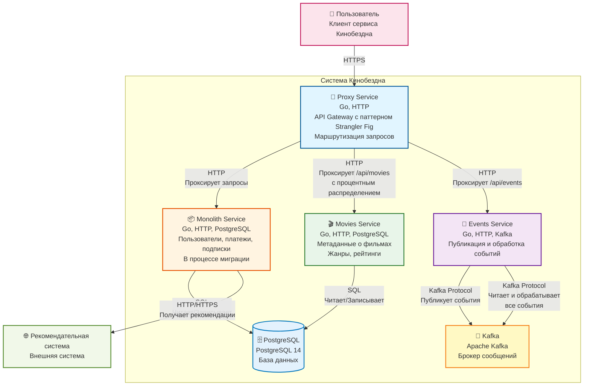

## Изучите [README.md](README.md) файл и структуру проекта.

## Статус выполнения

✅ **Задание 1**: Диаграмма C4 архитектуры создана в формате PlantUML  
✅ **Задание 2**: Proxy-сервис и Events-сервис реализованы на Go  
✅ **Задание 3**: CI/CD pipeline и Kubernetes манифесты настроены  
✅ **Задание 4**: Helm-чарты для всех сервисов реализованы  
✅ **Задание 5**: Circuit Breaker конфигурация для Istio создана

## Задание 1

1. Спроектируйте to be архитектуру КиноБездны, разделив всю систему на отдельные домены и организовав интеграционное взаимодействие и единую точку вызова сервисов.
Результат представьте в виде контейнерной диаграммы в нотации С4.

### Контейнерная диаграмма C4 (Mermaid)



### Описание компонентов

**🔀 Proxy Service (API Gateway)**
- **Технологии**: Go, HTTP
- **Назначение**: API Gateway с паттерном Strangler Fig
- **Функции**: 
  - Единая точка входа для всех клиентов
  - Маршрутизация запросов между монолитом и микросервисами
  - Постепенная миграция трафика с процентным распределением
  - Проксирование `/api/movies` с настраиваемым процентом миграции
  - Проксирование `/api/events/*` в Events Service
  - Проксирование остальных запросов в Monolith

**📦 Monolith Service**
- **Технологии**: Go, HTTP, PostgreSQL
- **Назначение**: Монолитное приложение в процессе миграции
- **Функции**: 
  - Управление пользователями (`/api/users`)
  - Обработка платежей (`/api/payments`)
  - Управление подписками (`/api/subscriptions`)
  - Обработка фильмов (в процессе миграции в Movies Service)
- **Интеграции**: 
  - Работа с PostgreSQL для хранения данных
  - Получение рекомендаций от внешней рекомендательной системы

**🎬 Movies Service**
- **Технологии**: Go, HTTP, PostgreSQL
- **Назначение**: Микросервис метаданных о фильмах
- **Функции**: 
  - Управление фильмами (`/api/movies`)
  - Управление жанрами
  - Управление рейтингами
- **Миграция**: Извлечен из монолита, обрабатывает запросы с процентным распределением через Proxy Service

**📡 Events Service**
- **Технологии**: Go, HTTP, Kafka
- **Назначение**: Микросервис событий (MVP для проверки Kafka)
- **Функции**: 
  - Принимает события через HTTP API (`/api/events/movie`, `/api/events/user`, `/api/events/payment`)
  - Публикует события в Kafka (топики: `movie-events`, `user-events`, `payment-events`)
  - Читает и обрабатывает события из Kafka (consumer)
  - Логирование всех обработанных событий

**🗄️ PostgreSQL**
- **Версия**: PostgreSQL 14
- **Назначение**: Реляционная база данных
- **Использование**: 
  - Монолит и Movies Service используют общую БД
  - Хранение данных о пользователях, фильмах, платежах, подписках

**📨 Kafka**
- **Технология**: Apache Kafka
- **Назначение**: Брокер сообщений для событийной архитектуры
- **Топики**: 
  - `movie-events` - события о фильмах
  - `user-events` - события о пользователях
  - `payment-events` - события о платежах
- **Использование**: Событийная коммуникация между сервисами

### Архитектурные решения

1. **Паттерн Strangler Fig**: Реализован через Proxy Service для постепенной миграции от монолита к микросервисам
2. **Единая точка входа**: Все запросы проходят через Proxy Service
3. **Событийная архитектура**: Events Service обеспечивает асинхронную коммуникацию через Kafka
4. **Разделение доменов**: 
   - Movies Service - домен фильмов
   - Monolith - домены пользователей, платежей, подписок
   - Events Service - домен событий


## Задание 2

### 1. Proxy ✅
Команда КиноБездны уже выделила сервис метаданных о фильмах movies и вам необходимо реализовать бесшовный переход с применением паттерна Strangler Fig в части реализации прокси-сервиса (API Gateway), с помощью которого можно будет постепенно переключать траффик, используя фиче-флаг.

**Реализовано:**
- Proxy-сервис на Go в `./src/microservices/proxy`
- Паттерн Strangler Fig с процентным распределением трафика
- Маршрутизация `/api/movies` с настраиваемым процентом миграции (MOVIES_MIGRATION_PERCENT)
- Проксирование `/api/events/*` в events-сервис
- Проксирование остальных запросов в монолит
- Health check endpoint `/health`
- Поддержка переменных окружения: `MONOLITH_URL`, `MOVIES_SERVICE_URL`, `EVENTS_SERVICE_URL`, `GRADUAL_MIGRATION`, `MOVIES_MIGRATION_PERCENT`

Реализуйте сервис на любом языке программирования в ./src/microservices/proxy.
Конфигурация для запуска сервиса через docker-compose уже добавлена
```yaml
  proxy-service:
    build:
      context: ./src/microservices/proxy
      dockerfile: Dockerfile
    container_name: cinemaabyss-proxy-service
    depends_on:
      - monolith
      - movies-service
      - events-service
    ports:
      - "8000:8000"
    environment:
      PORT: 8000
      MONOLITH_URL: http://monolith:8080
      #монолит
      MOVIES_SERVICE_URL: http://movies-service:8081 #сервис movies
      EVENTS_SERVICE_URL: http://events-service:8082 
      GRADUAL_MIGRATION: "true" # вкл/выкл простого фиче-флага
      MOVIES_MIGRATION_PERCENT: "50" # процент миграции
    networks:
      - cinemaabyss-network
```

- После реализации запустите postman тесты - они все должны быть зеленые.
- Отправьте запросы к API Gateway:
   ```bash
   curl http://localhost:8000/api/movies
   ```
- Протестируйте постепенный переход, изменив переменную окружения MOVIES_MIGRATION_PERCENT в файле docker-compose.yml.

### 2. Kafka ✅
 Вам как архитектору нужно также проверить гипотезу насколько просто реализовать применение Kafka в данной архитектуре.

Для этого нужно сделать MVP сервис events, который будет при вызове API создавать и сам же читать сообщения в топике Kafka.

**Реализовано:**
- Events-сервис на Go в `./src/microservices/events`
- Kafka Producer для публикации событий в топики: `movie-events`, `user-events`, `payment-events`
- Kafka Consumer для чтения и обработки событий из всех топиков
- API endpoints:
  - `POST /api/events/movie` - создание события фильма
  - `POST /api/events/user` - создание события пользователя
  - `POST /api/events/payment` - создание события платежа
  - `GET /api/events/health` - health check
- Логирование всех обработанных событий
- Использование библиотеки `github.com/IBM/sarama` для работы с Kafka
- Consumer Group для параллельной обработки событий

    - Разработайте сервис на любом языке программирования с consumer'ами и producer'ами. ✅
    - Реализуйте простой API, при вызове которого будут создаваться события User/Payment/Movie и обрабатываться внутри сервиса с записью в лог ✅
    - Добавьте в docker-compose новый сервис, kafka там уже есть ✅

Необходимые тесты для проверки этого API вызываются при запуске npm run test:local из папки tests/postman 

**Результаты тестов:**
- [Сводка результатов тестов Postman](test-results-summary.md)
- [Информация о топиках Kafka](kafka-topics-info.md)


## Задание 3

Команда начала переезд в Kubernetes для лучшего масштабирования и повышения надежности. 
Вам, как архитектору осталось самое сложное:
 - реализовать CI/CD для сборки прокси сервиса ✅
 - реализовать необходимые конфигурационные файлы для переключения трафика. ✅


### CI/CD ✅

**Реализовано:**
- GitHub Actions workflow в `.github/workflows/docker-build-push.yml`
- Матричная сборка для proxy-service и events-service
- Автоматическая сборка Docker-образов при push в main
- Публикация образов в GitHub Container Registry (ghcr.io)
- Запуск API тестов после сборки с использованием docker-compose
- Ожидание готовности сервисов перед запуском тестов
- Триггеры на изменения в `src/**` и `.github/workflows/docker-build-push.yml`

 В папке .github/workflows доработайте деплой новых сервисов proxy и events в docker-build-push.yml , чтобы api-tests при сборке отрабатывали корректно при отправке коммита в вашу новую ветку. ✅

**Выполнено:**
- Настроены триггеры для push в main с фильтрацией по путям `src/**` и `.github/workflows/docker-build-push.yml`
- Реализована матричная сборка для proxy-service и events-service
- Добавлен job `api-tests` с ожиданием готовности сервисов и запуском Postman тестов
- Настроена публикация образов в GitHub Container Registry

Как только сборка отработает и в github registry появятся ваши образы, можно переходить к блоку настройки Kubernetes
Успешным результатом данного шага является "зеленая" сборка и "зеленые" тесты


### Proxy в Kubernetes

#### Шаг 1 ✅
Для деплоя в kubernetes необходимо залогиниться в docker registry Github'а.
1. Создайте Personal Access Token (PAT) https://github.com/settings/tokens . Создавайте токен с правом read:packages
2. В src/kubernetes/*.yaml (events-service, monolith, movies-service и proxy-service)  отредактируйте путь до ваших образов 
```bash
 spec:
      containers:
      - name: events-service
        image: ghcr.io/ваш логин/имя репозитория/events-service:latest
```
3. Добавьте в секрет src/kubernetes/dockerconfigsecret.yaml в поле
```bash
 .dockerconfigjson: значение в base64 файла ~/.docker/config.json
```

4. Если в ~/.docker/config.json нет значения для аутентификации
```json
{
        "auths": {
                "ghcr.io": {
                       тут пусто
                }
        }
}
```
то выполните команду для логина:

```bash
echo ваш_токен | docker login ghcr.io -u ваш_логин --password-stdin
```

и добавьте

```json 
 "auth": "имя пользователя:токен в base64"
```

Чтобы получить значение в base64 можно выполнить команду
```bash
 echo -n ваш_логин:ваш_токен | base64
```

После заполнения config.json, также прогоните содержимое через base64

```bash
# Для Linux/macOS:
cat ~/.docker/config.json | base64

# Для Windows (PowerShell):
Get-Content $env:USERPROFILE\.docker\config.json | [Convert]::ToBase64String([System.Text.Encoding]::UTF8.GetBytes((Get-Content $env:USERPROFILE\.docker\config.json -Raw)))
```

и полученное значение добавляем в

```bash
 .dockerconfigjson: значение в base64 файла ~/.docker/config.json
```

#### Шаг 2 ✅

  Доработайте src/kubernetes/events-service.yaml и src/kubernetes/proxy-service.yaml ✅

  **Реализовано:**
  - `src/kubernetes/proxy-service.yaml`: Deployment и Service для proxy-сервиса
    - Порт 8000 (контейнер) -> 80 (сервис)
    - Health checks на `/health`
    - Environment variables из ConfigMap
    - ImagePullSecrets для доступа к GitHub Container Registry
  
  - `src/kubernetes/events-service.yaml`: Deployment и Service для events-сервиса
    - Порт 8082
    - Health checks на `/api/events/health`
    - Подключение к Kafka через переменную `KAFKA_BROKERS`
    - ImagePullSecrets для доступа к GitHub Container Registry
  
  - `src/kubernetes/ingress.yaml`: Добавлено правило для `/` -> proxy-service:80
    - Существующее правило для `/api/events` -> events-service:8082 сохранено
  
  - `src/kubernetes/configmap.yaml`: Добавлены переменные:
    - `EVENTS_SERVICE_URL: "http://events-service:8082"`
    - `PORT: "8000"` для proxy-сервиса

  - Необходимо создать Deployment и Service ✅
  - Доработайте ingress.yaml, чтобы можно было с помощью тестов проверить создание событий ✅
  - Выполните дальнейшие шаги для поднятия кластера:

  1. Создайте namespace:
  ```bash
  kubectl apply -f src/kubernetes/namespace.yaml
  ```
  2. Создайте секреты и переменные
  ```bash
  kubectl apply -f src/kubernetes/configmap.yaml
  kubectl apply -f src/kubernetes/secret.yaml
  kubectl apply -f src/kubernetes/dockerconfigsecret.yaml
  kubectl apply -f src/kubernetes/postgres-init-configmap.yaml
  ```

  3. Разверните базу данных:
  ```bash
  kubectl apply -f src/kubernetes/postgres.yaml
  ```

  На этом этапе если вызвать команду
  ```bash
  kubectl -n cinemaabyss get pod
  ```
  Вы увидите

  NAME         READY   STATUS    
  postgres-0   1/1     Running   

  4. Разверните Kafka:
  ```bash
  kubectl apply -f src/kubernetes/kafka/kafka.yaml
  ```

  Проверьте, теперь должно быть запущено 3 пода, если что-то не так, то посмотрите логи
  ```bash
  kubectl -n cinemaabyss logs имя_пода (например - kafka-0)
  ```

  5. Разверните монолит:
  ```bash
  kubectl apply -f src/kubernetes/monolith.yaml
  ```
  6. Разверните микросервисы:
  ```bash
  kubectl apply -f src/kubernetes/movies-service.yaml
  kubectl apply -f src/kubernetes/events-service.yaml
  ```
  7. Разверните прокси-сервис:
  ```bash
  kubectl apply -f src/kubernetes/proxy-service.yaml
  ```

  После запуска и поднятия подов вывод команды 
  ```bash
  kubectl -n cinemaabyss get pod
  ```

  Будет наподобие такого

  NAME                              READY   STATUS    

  events-service-7587c6dfd5-6whzx   1/1     Running  

  kafka-0                           1/1     Running   

  monolith-8476598495-wmtmw         1/1     Running  

  movies-service-6d5697c584-4qfqs   1/1     Running  

  postgres-0                        1/1     Running  

  proxy-service-577d6c549b-6qfcv    1/1     Running  

  zookeeper-0                       1/1     Running 

  8. Добавим ingress

  - добавьте аддон
  ```bash
  minikube addons enable ingress
  ```
  ```bash
  kubectl apply -f src/kubernetes/ingress.yaml
  ```
  9. Добавьте в /etc/hosts
  127.0.0.1 cinemaabyss.example.com

  10. Вызовите
  ```bash
  minikube tunnel
  ```
  11. Вызовите https://cinemaabyss.example.com/api/movies
  Вы должны увидеть вывод списка фильмов
  Можно поэкспериментировать со значением MOVIES_MIGRATION_PERCENT в src/kubernetes/configmap.yaml и убедиться, что вызовы movies уходят полностью в новый сервис

  12. Запустите тесты из папки tests/postman
  ```bash
   npm run test:kubernetes
  ```
  Часть тестов с health-чек упадет, но создание событий отработает.

#### Шаг 3


## Задание 4 ✅
Для простоты дальнейшего обновления и развертывания вам как архитектору необходимо так же реализовать helm-чарты для прокси-сервиса и проверить работу 

**Реализовано:**
- Helm-шаблоны для proxy-service и events-service в `src/kubernetes/helm/templates/services/`
- Конфигурация в `values.yaml` с настройками для обоих сервисов
- Поддержка всех параметров: image, replicas, resources, service ports
- Использование imagePullSecrets из values.yaml
- Health checks и readiness/liveness probes

Для этого:
1. Перейдите в директорию helm и отредактируйте файл values.yaml ✅

```yaml
# Proxy service configuration
proxyService:
  enabled: true
  image:
    repository: ghcr.io/db-exp/cinemaabysstest/proxy-service
    tag: latest
    pullPolicy: Always
  replicas: 1
  resources:
    limits:
      cpu: 300m
      memory: 256Mi
    requests:
      cpu: 100m
      memory: 128Mi
  service:
    port: 80
    targetPort: 8000
    type: ClusterIP
```

- Вместо ghcr.io/db-exp/cinemaabysstest/proxy-service напишите свой путь до образа для всех сервисов
- для imagePullSecret проставьте свое значение (скопируйте из конфигурации kubernetes)
  ```yaml
  imagePullSecrets:
      dockerconfigjson: ewoJImF1dGhzIjogewoJCSJnaGNyLmlvIjogewoJCQkiYXV0aCI6ICJaR0l0Wlhod09tZG9jRjl2UTJocVZIa3dhMWhKVDIxWmFVZHJOV2hRUW10aFVXbFZSbTVaTjJRMFNYUjRZMWM9IgoJCX0KCX0sCgkiY3JlZHNTdG9yZSI6ICJkZXNrdG9wIiwKCSJjdXJyZW50Q29udGV4dCI6ICJkZXNrdG9wLWxpbnV4IiwKCSJwbHVnaW5zIjogewoJCSIteC1jbGktaGludHMiOiB7CgkJCSJlbmFibGVkIjogInRydWUiCgkJfQoJfSwKCSJmZWF0dXJlcyI6IHsKCQkiaG9va3MiOiAidHJ1ZSIKCX0KfQ==
  ```

2. В папке ./templates/services заполните шаблоны для proxy-service.yaml и events-service.yaml (опирайтесь на свою kubernetes конфигурацию - смысл helm'а сделать шаблоны для быстрого обновления и установки) ✅

**Реализованные шаблоны:**
- `proxy-service.yaml`: Полный Deployment и Service с использованием значений из values.yaml
  - Динамические значения для image, ports, resources
  - Environment variables из ConfigMap
  - Health checks
  
- `events-service.yaml`: Полный Deployment и Service с использованием значений из values.yaml
  - Динамические значения для image, ports, resources
  - Kafka broker configuration
  - Health checks

```yaml
template:
    metadata:
      labels:
        app: proxy-service
    spec:
      containers:
       Тут ваша конфигурация
```

3. Проверьте установку
Сначала удалим установку руками

```bash
kubectl delete all --all -n cinemaabyss
kubectl delete  namespace cinemaabyss
```
Запустите 
```bash
# Для Linux/macOS:
helm install cinemaabyss ./src/kubernetes/helm --namespace cinemaabyss --create-namespace

# Для Windows:
helm install cinemaabyss .\src\kubernetes\helm --namespace cinemaabyss --create-namespace
```
Если в процессе будет ошибка
```code
[2025-04-08 21:43:38,780] ERROR Fatal error during KafkaServer startup. Prepare to shutdown (kafka.server.KafkaServer)
kafka.common.InconsistentClusterIdException: The Cluster ID OkOjGPrdRimp8nkFohYkCw doesn't match stored clusterId Some(sbkcoiSiQV2h_mQpwy05zQ) in meta.properties. The broker is trying to join the wrong cluster. Configured zookeeper.connect may be wrong.
```

Проверьте развертывание:
```bash
kubectl get pods -n cinemaabyss
minikube tunnel
```

Потом вызовите 
https://cinemaabyss.example.com/api/movies

ЛОГ ВМЕСТО СКРИНШОТА: [helm-deployment.log](helm-deployment.log)


# Задание 5 ✅
Компания планирует активно развиваться и для повышения надежности, безопасности, реализации сетевых паттернов типа Circuit Breaker и канареечного деплоя вам как архитектору необходимо развернуть istio и настроить circuit breaker для monolith и movies сервисов.

**Реализовано:**
- Конфигурация Circuit Breaker в `src/kubernetes/circuit-breaker-config.yaml`
- DestinationRule для monolith с настройками:
  - Connection Pool: maxConnections: 10, http1MaxPendingRequests: 5, http2MaxRequests: 10
  - Outlier Detection: consecutiveErrors: 3, interval: 30s, baseEjectionTime: 30s, maxEjectionPercent: 50
  
- DestinationRule для movies-service с аналогичными настройками
- Использование Istio networking API v1beta1

```bash

helm repo add istio https://istio-release.storage.googleapis.com/charts
helm repo update

helm install istio-base istio/base -n istio-system --set defaultRevision=default --create-namespace
helm install istio-ingressgateway istio/gateway -n istio-system
helm install istiod istio/istiod -n istio-system --wait

# Для Linux/macOS:
helm install cinemaabyss ./src/kubernetes/helm --namespace cinemaabyss --create-namespace

# Для Windows:
helm install cinemaabyss .\src\kubernetes\helm --namespace cinemaabyss --create-namespace

kubectl label namespace cinemaabyss istio-injection=enabled --overwrite

kubectl get namespace -L istio-injection

# Для Linux/macOS:
kubectl apply -f ./src/kubernetes/circuit-breaker-config.yaml -n cinemaabyss

# Для Windows:
kubectl apply -f .\src\kubernetes\circuit-breaker-config.yaml -n cinemaabyss

```

Тестирование

# fortio
```bash
kubectl apply -f https://raw.githubusercontent.com/istio/istio/release-1.25/samples/httpbin/sample-client/fortio-deploy.yaml -n cinemaabyss
```

# Get the fortio pod name
```bash
FORTIO_POD=$(kubectl get pod -n cinemaabyss | grep fortio | awk '{print $1}')

kubectl exec -n cinemaabyss $FORTIO_POD -c fortio -- fortio load -c 50 -qps 0 -n 500 -loglevel Warning http://movies-service:8081/api/movies
```
Например,

```bash
kubectl exec -n cinemaabyss fortio-deploy-b6757cbbb-7c9qg  -c fortio -- fortio load -c 50 -qps 0 -n 500 -loglevel Warning http://movies-service:8081/api/movies
```

Вывод будет типа такого

```bash
IP addresses distribution:
10.106.113.46:8081: 421
Code 200 : 79 (15.8 %)
Code 500 : 22 (4.4 %)
Code 503 : 399 (79.8 %)
```
Можно еще проверить статистику

```bash
kubectl exec -n cinemaabyss fortio-deploy-b6757cbbb-7c9qg -c istio-proxy -- pilot-agent request GET stats | grep movies-service | grep pending
```

И там смотрим 

```bash
cluster.outbound|8081||movies-service.cinemaabyss.svc.cluster.local;.upstream_rq_pending_total: 311 - столько раз срабатывал circuit breaker
You can see 21 for the upstream_rq_pending_overflow value which means 21 calls so far have been flagged for circuit breaking.
```


Удаляем все
```bash
istioctl uninstall --purge
kubectl delete namespace istio-system
kubectl delete all --all -n cinemaabyss
kubectl delete namespace cinemaabyss
```
